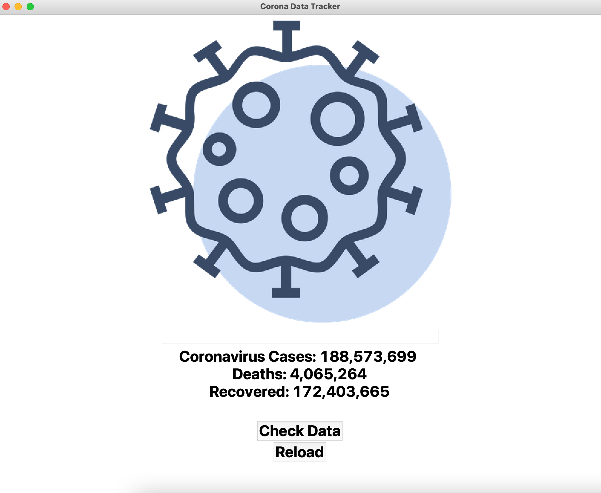
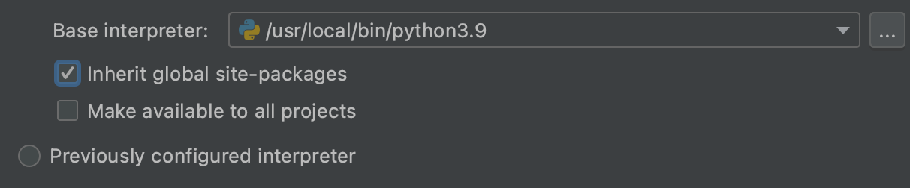

# CovidTracker

Build in Python, Beautiful Soup4, tkinter

## ScreenShot Result



## How to install pip & create virtual environment? 
  you have two way to do 
      1. using pyCharm --> it automatic install virtual environment and pip for you 
      
      2. install by self in terminal; here is steps: 

  Put here the folder name
  
      ```cd <folder-with-my-project> ```   
      
  Create a dedicated app directory
  
       ```mkdir main.py```  
       
  into project folder     
  
       ```cd corona-app```              
      
  install pip 
  
      ```sudo easy_install pip``` 
      
  install virtualenv
  
      ```python3 -m pip install virtualenv```  
      
  Create the virtual environment 'venv'
  
       ```virtualenv venv```            
       
  Activate virtual environment
  
       ```source venv/bin/activate``` 
       
       
  two Package use in our project
  
       ```pip install requests 
          pip install beautifulsoup4```  
         
      

      
## What problem faced in this project?
I struggled for an hour to solve the problem "Python ModuleNotFoundError: No module named 'requests'"
In multiple article and video shows that there two reasons causing this kind problem.   
1. uninstall ``` pip install requests ```
2. program can't find path 

How do I solved? I believe my problem is causing by reason2. I changed python project in PsCharm and check out "Inheritat gloabl site-packages" then everything works. 



